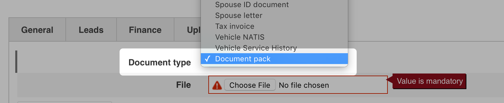
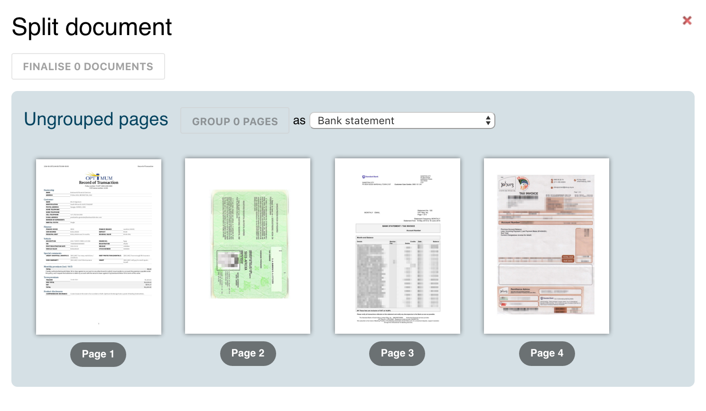
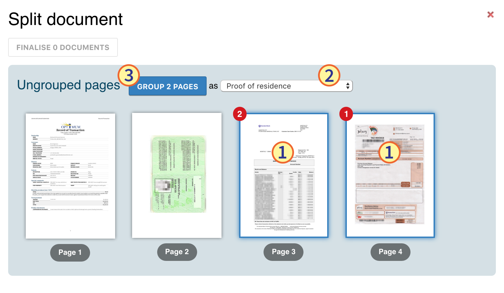
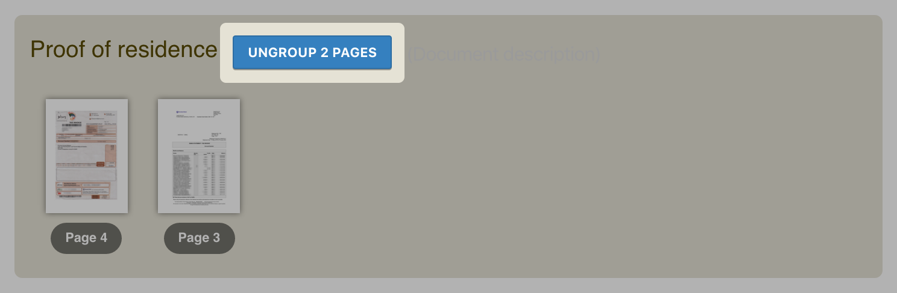
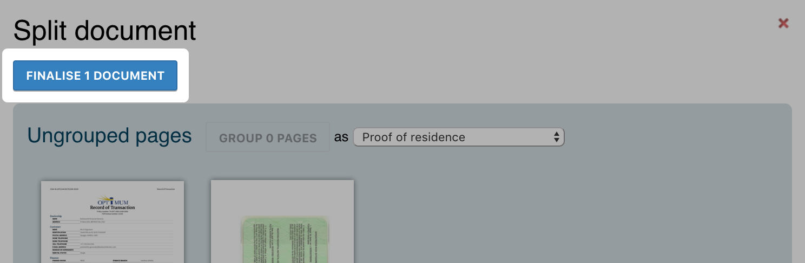
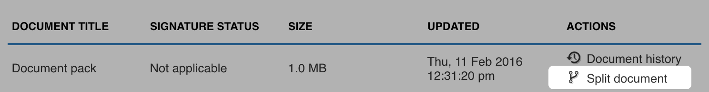

================
 Document packs
================

A :term:`document pack` is a single PDF document that contains several documents
that may not necessarily be related, for example: A PDF that contains a scan of
an ID document, bank statements and drivers license would be categorised as a
document pack.

.. _upload-document-packs-section:

Uploading document packs
========================

Fusion caters for document packs via a special "Document pack" document type
available when performing a document upload. :numref:`upload-document-type`

   Document type to use when uploading document packs.

Splitting document packs
========================

.. note::

   This requires at least Internet Explorer 8 to function, otherwise the pack is
   simply uploaded as a regular document.

Institutions accepting electronic supporting documentation do not want large
pack documents, instead they want these documents categorised and uploaded
individually. One way to accomplish this is to scan the documents one at a time
but that can be time consuming. Another method is to :ref:`upload the document
<upload-document-packs-section>` to Fusion as the "Document pack" type and use
Fusion to split the pack into several smaller documents.
:numref:`document-splitter-initial`

   Document splitter as it appears immediately after uploading a document.

Grouping pages into new documents
---------------------------------

New documents are formed in few simple steps: :numref:`group-pages`

1. Selecting the pages from the "Ungrouped documents" section—by clicking on the
   page images—to include in the new document, a page is selected when it is
   surrounded by a blue border and contains a red number in the top left.

2. Selecting the document type ("ID document", etc.) from the drop-down list.

3. Clicking the :guilabel:`Group pages` button.

.. note::

   The red numbers indicate the order in which the pages will appear in the new
   document.

   Selected pages prior to being grouped.

Repeat these steps for each document contained in the pack that needs to be
separated. Once pages have been grouped they will be removed from the "Ungrouped
documents" section, see :ref:`Ungrouping pages <ungroup-pages-section>` to
correct grouping mistakes.

.. warning::

   None of these actions have permanent results until the :ref:`documents are
   finalised <finalise-documents-section>`.

.. _ungroup-pages-section:

Ungrouping pages
----------------

Pages can easily be returned to the "Ungrouped pages" section by simply clicking
the :guilabel:`Ungroup pages` button in the appropriate section.
:numref:`ungroup-pages`

   Action to return previously grouped pages to the "Ungrouped pages" section.

.. _finalise-documents-section:

Creating the new documents
--------------------------

Once all the pertinent documentation has been grouped and categorised correctly
the changes can be made permanent by clicking the :guilabel:`Finalise documents`
button above the "Ungrouped pages" section. Fusion will then split the document
pack into the specified new documents and store them in the "Upload"
documentation section. :numref:`finalise-documents`

   Request that Fusion split the document pack up as indicated.

Splitting previously uploaded documents
---------------------------------------

It is possible to split document packs that were previously uploaded by clicking
the :guilabel:`Split document` action to the right of the document title in any
:term:`documents listing`. :numref:`split-document-action`

   Action to split a previously uploaded document.

.. note::

   Only "Document pack" document types may be split in this way.
