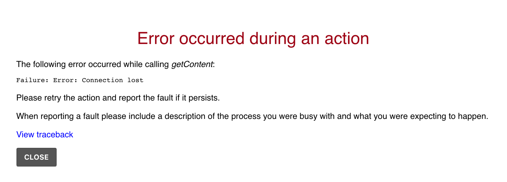
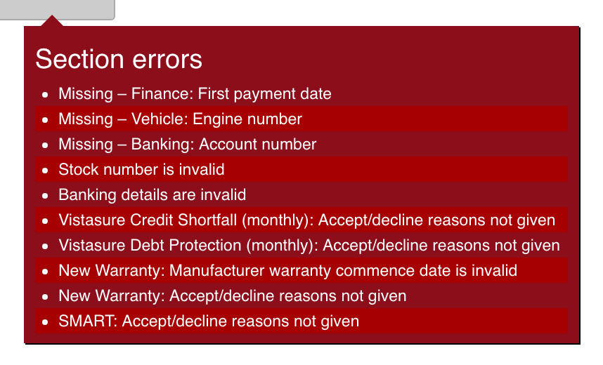

========
 Issues
========

Identifying issues
==================

An issue on Fusion may appear in many forms, an error dialog
:numref:`error-dialog`, an error message :numref:`error-message`, an incorrect
result or a failure submitting a finance application, to name a few.

   An error dialog that may appear as a result of a network issue or a system bug.

   An error message that may appear as a result of a validation error, a system
   error, or many other possibilities.

Fusion Support can resolve a large number of issues directly, these include (but
are not limited to) software bugs in Fusion, missing features, validation errors
and so forth.

Some issues may be present in third-party systems (financial institutions,
product providers, etc.) that will require Fusion Support to contact third-party
technical or business personnel in order to obtain more information about the
problem.

In either of these cases, reporting the issue to Fusion Support is the best
course of action. If Fusion Support are unable to resolve the issue directly
they can relay the necessary information and technical details to the relevant
parties on your behalf.

.. _reporting-issues-section:

Reporting issues
================

Fusion Support may be contacted via email on <support@fusionapp.com>.

.. important::

   Fusion Support's ability to render assistance is limited by the information
   provided to them. **Please consider whether you have provided enough
   information in your issue before submitting it.**

Issues should contain—at the *very* least—the following information:

  * Fusion quote number
      For example, ``BZ-ABC-1234-1601-0001Q``. Without a quote number there is
      often no way for an investigation into the problem to proceed.
  * Brief description of the problem
      For example, "Uploading supporting documents to WesBank is failing". A
      description of the problem helps narrow down the possible aspects that
      need to be investigated.

It is suggested that the following information is also included to improve
response times and the possibility of being able to resolve the issue:

  * Screenshot of the error
      Microsoft provide `a comprehensive article <windows-screenshot_>`_ on how
      best to take a screenshot in Windows.
  * Steps leading up to the error
      For example, "After incepting the quote I received the error in the
      screenshot."

.. _windows-screenshot: http://windows.microsoft.com/en-za/windows/use-snipping-tool-capture-screen-shots

Reporting issues from Fusion
----------------------------

It is possible to have Fusion automatically draft an email to Fusion Support
that contains information about the current page being viewed on Fusion, simply
click the life-buoy icon in the top right of Fusion.
:numref:`fusion-support-action`

.. note::

   It is still important to include the pertinent details—except the quote
   number—as described in :ref:`reporting-issues-section` when using this
   method.

   The life-buoy icon that will draft a mail to Fusion Support.
